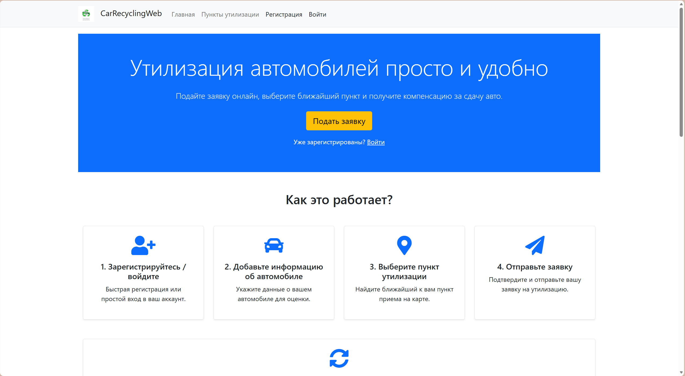
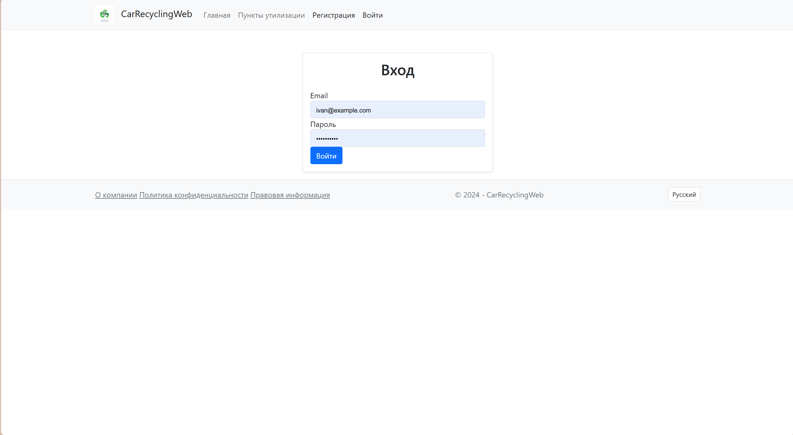
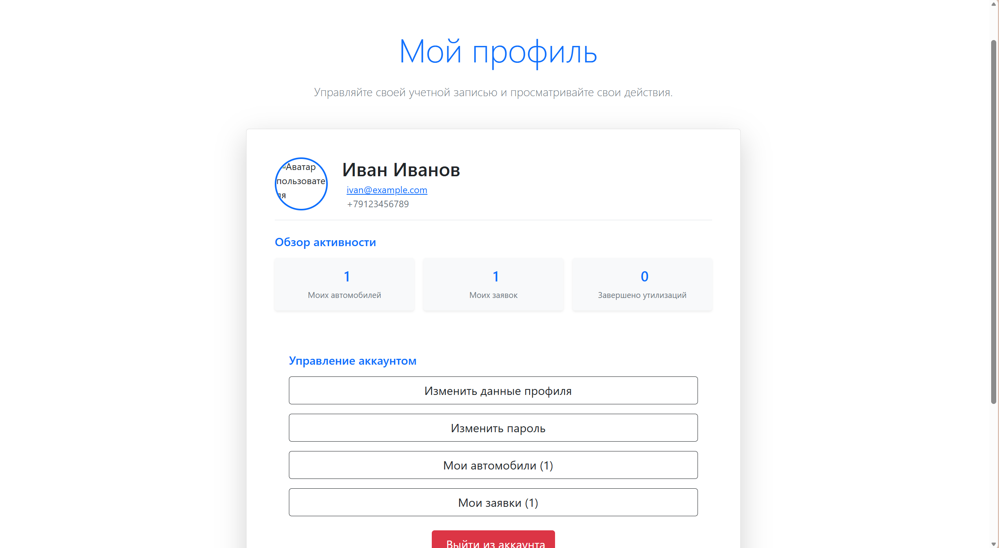
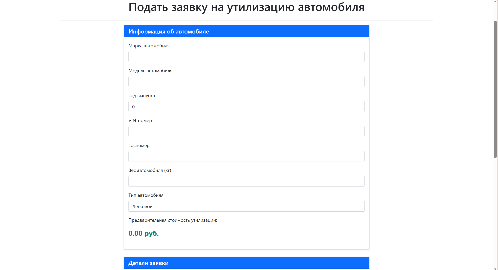
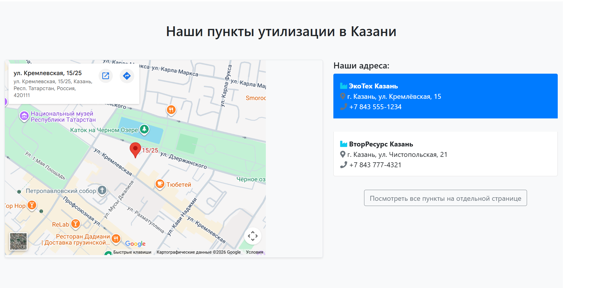
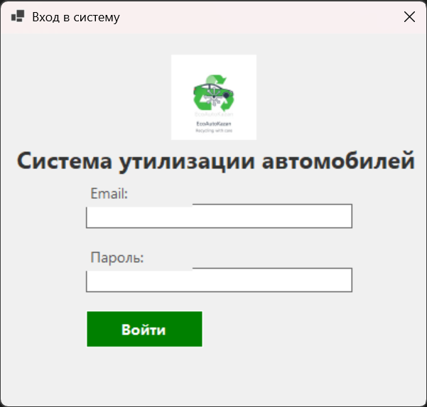
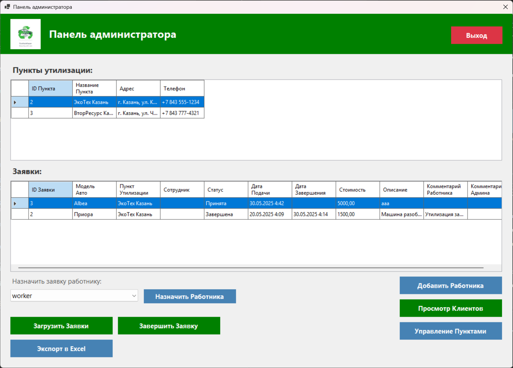
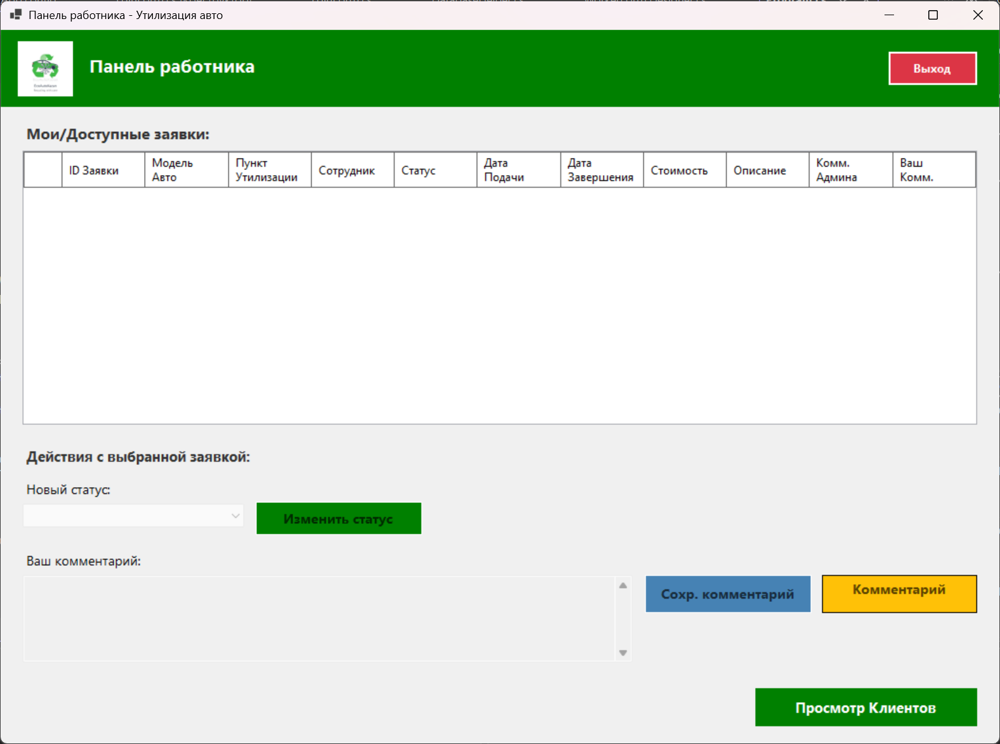
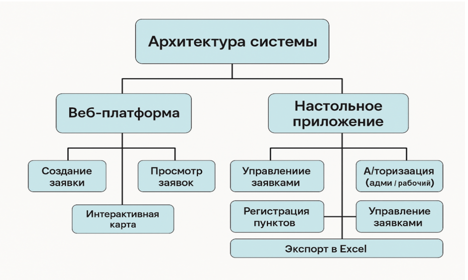
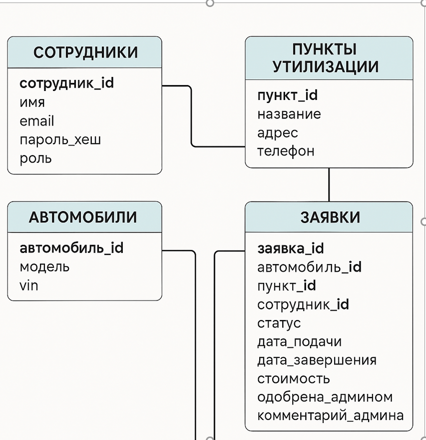

# 🚗 Car Recycling Management System


Полноценная информационная система для автоматизации процесса переработки и утилизации автомобилей.

Проект состоит из двух приложений:

- 🌐 **Веб-приложение** для клиентов
- 🖥 **Десктопное приложение** для сотрудников и администраторов

---

## 📑 Содержание

- [О проекте](#-о-проекте)
- [Основные возможности](#-основные-возможности)
- [Скриншоты](#-скриншоты)
- [Архитектура](#-архитектура)
- [Используемые технологии](#-используемые-технологии)
- [Структура проекта](#-структура-проекта)
- [База данных](#-база-данных)
- [Роли пользователей](#-роли-пользователей)
- [Установка](#-установка)
- [Запуск](#-запуск)
- [Тестовые пользователи](#-тестовые-пользователи)
- [Roadmap](#-roadmap)
- [Автор](#-автор)
- [Лицензия](#-лицензия)

---

## 📖 О проекте

Car Recycling Management System — информационная система для автоматизации процесса подачи и обработки заявок на утилизацию автомобилей.

Основная цель проекта — объединить клиентов, сотрудников и администраторов в единой системе, обеспечивающей удобное взаимодействие с пунктами приёма автомобилей.

Проект разработан в качестве дипломной работы и демонстрирует использование современных технологий платформы .NET, Entity Framework Core и MySQL.

---

## ✨ Основные возможности

### 🌐 Веб-приложение

- Регистрация пользователей
- Авторизация
- Личный кабинет
- Добавление автомобиля
- Создание заявки
- Просмотр статуса заявки
- Просмотр пунктов приёма
- Карта пунктов
- Отзывы пользователей

---

### 🖥 Десктопное приложение

- Авторизация сотрудников
- Просмотр всех заявок
- Изменение статусов
- Управление сотрудниками
- Управление пунктами приёма
- Просмотр клиентов
- Работа с автомобилями
- Администрирование системы

---

## 📸 Скриншоты

### 🌐 Веб-приложение (для клиентов)

| Главная страница | Авторизация |
|------------------|-------------|
|  |  |

| Личный кабинет | Создание заявки |
|----------------|-----------------|
|  |  |

| Карта пунктов утилизации |
|--------------------------|
|  |

---

### 🖥️ Десктоп-приложение (для сотрудников и администраторов)

| Вход в систему | Панель администратора |
|----------------|-----------------------|
|  |  |

| Панель работника |
|------------------|
|  |

---

## 🏗️ Архитектура системы

### 🌐 Веб-платформа (клиентская часть)
- Создание заявки
- Интерактивная карта
- Просмотр заявок
- Управление заявками
- Регистрация пунктов
- Авторизация (админ / рабочий)
- Экспорт в Excel

### 🖥️ Настольное приложение (административная часть)
- Авторизация (администратор / работник)
- Управление заявками
- Экспорт в Excel
- Управление сотрудниками
- Управление пунктами утилизации
- Просмотр клиентов
---

## 🛠 Используемые технологии

| Компонент | Технология |
|-----------|------------|
| Backend | ASP.NET Core MVC |
| Desktop | Windows Forms |
| ORM | Entity Framework Core |
| Database | MySQL |
| Language | C# |
| Framework | .NET 8 |
| Frontend | HTML, CSS, JavaScript |
| UI | Bootstrap 5 |
| Version Control | Git |

---

## 📂 Структура проекта

```text
Car-Recycling-Management-System/
│
├── CarRecyclingWeb/                 # Веб-приложение (ASP.NET Core MVC)
│   ├── Controllers/                 # Контроллеры
│   ├── Models/                      # Модели данных
│   ├── Views/                       # Razor-представления
│   └── wwwroot/                     # CSS, JS, изображения
│
├── CarRecyclingApp/                 # Десктопное приложение (WinForms)
│   ├── Forms/                       # Формы приложения
│   ├── Models/                      # Модели данных
│   └── Services/                    # Сервисы
│
└── database/
    └── Dump20250530.sql             # Дамп базы данных MySQL
```

---

## 🗄️ Схема базы данных

### 👤 Сотрудники (`employees`)
- `сотрудник_id` — уникальный идентификатор
- `имя` — имя сотрудника
- `email` — email (уникальный)
- `пароль_хеш` — хеш пароля
- `роль` — admin / worker

### 📍 Пункты утилизации (`recyclingpoints`)
- `пункт_id` — уникальный идентификатор
- `название` — название пункта
- `адрес` — адрес
- `телефон` — контактный телефон

### 🚗 Автомобили (`cars`)
- `автомобиль_id` — уникальный идентификатор
- `модель` — модель автомобиля
- `vin` — VIN-номер

### 📝 Заявки (`requests`)
- `заявка_id` — уникальный идентификатор
- `автомобиль_id` — ссылка на автомобиль
- `пункт_id` — ссылка на пункт утилизации
- `сотрудник_id` — ссылка на сотрудника
- `статус` — статус заявки
- `дата_подачи` — дата создания
- `дата_завершения` — дата завершения
- `стоимость` — стоимость утилизации
- `одобрена_админом` — флаг одобрения
- `комментарий_админа` — комментарий администратора
---

## 📋 Таблицы и поля

### 👤 Клиенты (`clients`)

| Поле | Тип | Описание |
|------|-----|----------|
| `ClientId` | INT (PK) | Уникальный идентификатор клиента |
| `FirstName` | VARCHAR(100) | Имя клиента |
| `LastName` | VARCHAR(100) | Фамилия клиента |
| `Email` | VARCHAR(100) | Email (уникальный) |
| `PasswordHash` | VARCHAR(255) | Хеш пароля |
| `PhoneNumber` | VARCHAR(20) | Номер телефона |

---

### 👨‍💼 Сотрудники (`employees`)

| Поле | Тип | Описание |
|------|-----|----------|
| `EmployeeId` | INT (PK) | Уникальный идентификатор сотрудника |
| `Name` | VARCHAR(100) | Имя сотрудника |
| `Email` | VARCHAR(100) | Email (уникальный) |
| `PasswordHash` | VARCHAR(255) | Хеш пароля |
| `Role` | VARCHAR(50) | Роль (`admin` / `worker`) |

---

### 🚗 Автомобили (`cars`)

| Поле | Тип | Описание |
|------|-----|----------|
| `CarId` | INT (PK) | Уникальный идентификатор автомобиля |
| `ClientId` | INT (FK) | Владелец автомобиля |
| `Brand` | VARCHAR(100) | Марка автомобиля |
| `Model` | VARCHAR(100) | Модель автомобиля |
| `Year` | INT | Год выпуска |
| `VIN` | VARCHAR(50) | VIN-номер (уникальный) |
| `LicensePlate` | VARCHAR(10) | Государственный номер |
| `WeightKg` | DECIMAL(10,2) | Вес автомобиля (кг) |
| `VehicleType` | VARCHAR(50) | Тип транспортного средства |

---

### 📍 Пункты утилизации (`recyclingpoints`)

| Поле | Тип | Описание |
|------|-----|----------|
| `PointId` | INT (PK) | Уникальный идентификатор пункта |
| `Name` | VARCHAR(100) | Название пункта |
| `Address` | VARCHAR(255) | Адрес |
| `PhoneNumber` | VARCHAR(20) | Телефон |
| `MapUrl` | TEXT | Ссылка на карту (Google Maps) |
| `OpeningHours` | VARCHAR(200) | Часы работы |
| `Description` | TEXT | Описание |
| `ImageUrl` | TEXT | Ссылка на изображение |

---

### 📝 Заявки (`requests`)

| Поле | Тип | Описание |
|------|-----|----------|
| `RequestId` | INT (PK) | Уникальный идентификатор заявки |
| `CarId` | INT (FK) | Автомобиль |
| `ClientId` | INT (FK) | Клиент |
| `RecyclingPointId` | INT (FK) | Пункт утилизации |
| `EmployeeId` | INT (FK) | Сотрудник (обработчик) |
| `Status` | VARCHAR(50) | Статус заявки |
| `SubmissionDate` | DATETIME | Дата подачи |
| `PreferredDisposalDate` | DATETIME | Желаемая дата утилизации |
| `Condition` | VARCHAR(50) | Состояние автомобиля |
| `Description` | VARCHAR(500) | Дополнительное описание |
| `CompletionDate` | DATETIME | Дата завершения |
| `Cost` | DECIMAL(10,2) | Стоимость |
| `AdminConfirmed` | BOOLEAN | Одобрена администратором |
| `WorkerComment` | TEXT | Комментарий сотрудника |
| `AdminComment` | TEXT | Комментарий администратора |

---

### ⭐ Отзывы (`feedbacks`)

| Поле | Тип | Описание |
|------|-----|----------|
| `FeedbackId` | INT (PK) | Уникальный идентификатор отзыва |
| `RequestId` | INT (FK) | Заявка |
| `ClientId` | INT (FK) | Клиент |
| `Rating` | INT | Рейтинг (1–5) |
| `Comment` | VARCHAR(500) | Текст отзыва |
| `SubmissionDate` | DATETIME | Дата отзыва |

---

## 🔗 Связи между таблицами

| Связь | Тип | Описание |
|-------|-----|----------|
| `clients` → `cars` | 1 ко многим | Один клиент может иметь несколько автомобилей |
| `clients` → `requests` | 1 ко многим | Один клиент может иметь несколько заявок |
| `clients` → `feedbacks` | 1 ко многим | Один клиент может оставить несколько отзывов |
| `cars` → `requests` | 1 ко многим | Один автомобиль может быть в нескольких заявках |
| `recyclingpoints` → `requests` | 1 ко многим | В один пункт может быть подано несколько заявок |
| `employees` → `requests` | 1 ко многим | Один сотрудник может обрабатывать несколько заявок |
| `requests` → `feedbacks` | 1 к 1 | К одной заявке может быть только один отзыв |

---

## 📊 Статусы заявок

| Статус | Описание |
|--------|----------|
| `Принята` | Заявка создана, ожидает обработки |
| `В обработке` | Сотрудник начал работу с заявкой |
| `Одобрена` | Администратор одобрил заявку |
| `Выполняется` | Идёт процесс утилизации |
| `Завершена` | Утилизация выполнена |
| `Отклонена` | Заявка отклонена |

---

### Архитектура и схема БД

| Архитектура системы | Схема базы данных |
|---------------------|-------------------|
|  |  |

---

## 🚀 Запуск проекта

### 1️⃣ Клонирование репозитория

```bash
git clone https://github.com/Aidarro14/Car-Recycling-Management-System.git
cd Car-Recycling-Management-System
```

---

### 2️⃣ Настройка базы данных

1. Установите **MySQL Server**.
2. Создайте базу данных.
3. Выполните SQL-скрипт:

```text
database/Dump20250530.sql
```

4. Настройте строку подключения в файле:

```text
CarRecyclingWeb/appsettings.json
```

При необходимости аналогично измените строку подключения в десктопном приложении.

---

### 3️⃣ Запуск веб-приложения

```bash
cd CarRecyclingWeb
dotnet restore
dotnet run
```

После запуска откройте браузер и перейдите по адресу:

```
https://localhost:5001
```

---

### 4️⃣ Запуск десктопного приложения

```bash
cd CarRecyclingApp
dotnet restore
dotnet run
```

или откройте файл решения (`.sln`) в **Visual Studio** и нажмите **Start**.

---

## 👤 Тестовые пользователи

| Роль | Email | Пароль |
|------|-------|---------|
| 👑 Администратор | `admin@example.com` | `admin123` |
| 👨‍💼 Сотрудник | `worker@example.com` | `worker123` |
| 👤 Клиент | `ivan@example.com` | `Client123!` |

---

## 🚀 Roadmap

- [x] Авторизация
- [x] Регистрация
- [x] Управление заявками
- [x] Работа с MySQL
- [x] Entity Framework Core
- [x] Веб-приложение
- [x] Десктопное приложение
- [ ] REST API
- [ ] Docker
- [ ] JWT
- [ ] Email-уведомления
- [ ] Мобильное приложение

---

## 👨‍💻 Автор

**Айдар**

Дипломный проект по разработке информационной системы управления переработкой автомобилей.

GitHub: https://github.com/Aidarro14

---

## 📄 Лицензия

Проект распространяется по лицензии MIT.

Разработан исключительно в образовательных целях как дипломная работа.
